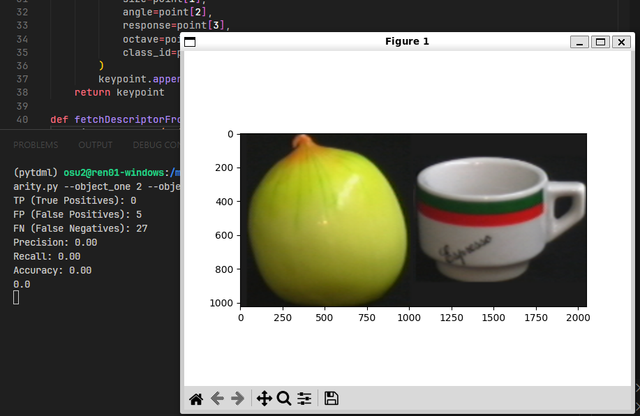
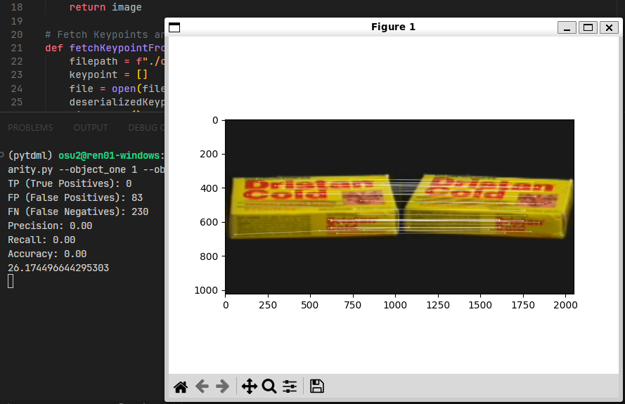

# Detección de Objetos por Color en COIL-100

Este repositorio lo cree para subir mi tarea de Visión por Computadora, en esto se nos pidió usar la base de datos de [COIL-100](https://www.cs.columbia.edu/CAVE/software/softlib/coil-100.php) y el metodo SIFT.

## Obtener los puntos claves o entrenamiento

Para obtener los puntos clave de cada objeto se usa lo siguiente:

```bash
python train.py --number_object 1
```

El argumetno `--number_object` recibe el numero de objeto a entrenar, para esto hay que tener la siguiente estructura dentro de la carpeta de coil-100 del objeto que se quiere trabajar, quedando de la siguiente manera:

```
objeto1
├── descriptors
│   ├── obj1__0.pkl
│   ...
├── images
│   ├── obj1__0.png
│   ...
└── keypoints
    ├── obj1__0.pkl
    ...
```

Se recomienda crear las carpetas de forma manual y ir agregando cada imagen en la carpeta de imagenes igualmente de forma manual

De cualquier manera se proporciona un ejemplo en el repositorio.


## Comparar dos objetos

Para comparar los dos objetos de interes, se usa el siguiente comando:

```bash
python similarity.py --object_one 1 --object_two 1 --object_one_angle 355 --object_two_angle 10
```

El argumento `--object_one` es el numero del objeto a comparar, igualmente para `--object_two`, es necesario darles un valor.

El argumento `--object_one_angle` es el angulo de la imagen a trabajar, igual mente aplica para `--object_two_angle`, no es necesario porque por default toma el angulo 0.

## Resultados esperados



